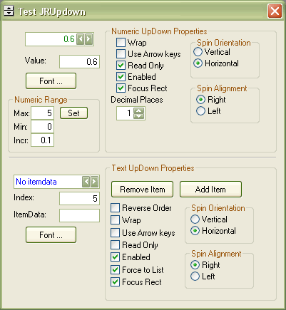



## Numeric and Textual Updown Box Controls

### Description

Hello; This is my first post to PSC I hope someone can find it usefull.

The program contains two controls: Numeric Updown and Textual UpDown, the numeric updown can handle fractional values, and restricts the typing of numeic values only.

The Textual Updown has similar funcionality to a Listbox, with the diference that it can handles string values in the itemdata property.

Also I use some API to modify the textboxes apparience.

Please Vote :)
 
### More Info
 

             |
---                |---
**Submitted On**   |2004-05-04 13:15:12
**By**             |[Jose Reynaldo Chavarria](https://github.com/Planet-Source-Code/PSCIndex/blob/master/ByAuthor/jose-reynaldo-chavarria.md)
**Level**          |Intermediate
**User Rating**    |5.0 (35 globes from 7 users)
**Compatibility**  |VB 6\.0
**Category**       |[Custom Controls/ Forms/  Menus](https://github.com/Planet-Source-Code/PSCIndex/blob/master/ByCategory/custom-controls-forms-menus__1-4.md)
**World**          |[Visual Basic](https://github.com/Planet-Source-Code/PSCIndex/blob/master/ByWorld/visual-basic.md)
**Archive File**   |[Numeric\_an174107542004\.zip](https://github.com/Planet-Source-Code/jose-reynaldo-chavarria-numeric-and-textual-updown-box-controls__1-53561/archive/master.zip)

